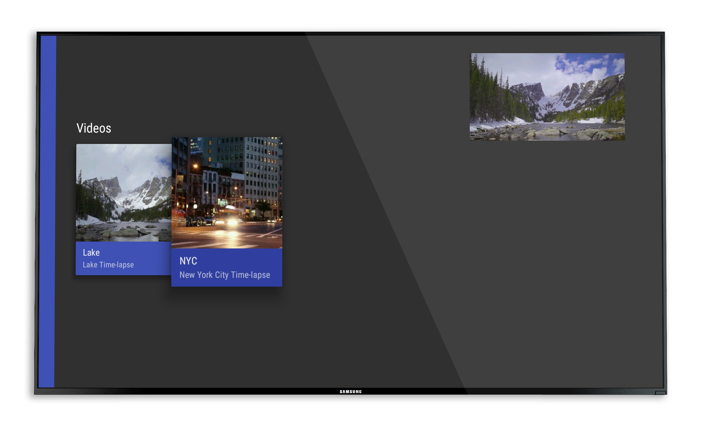

#Picture-in-Picture Playground
==============================

<p align="center">
    
</p>

This is a simple sample app to try out the new Android N Picture-in-Picture mode for Android TV.

To compile the project you'll need:

- JDK 8
- Android N
- Build tools 24.0.0 rc1


#Building

To build, install and run a debug version, run this from the root of the project:

```./gradlew assembleDebug```